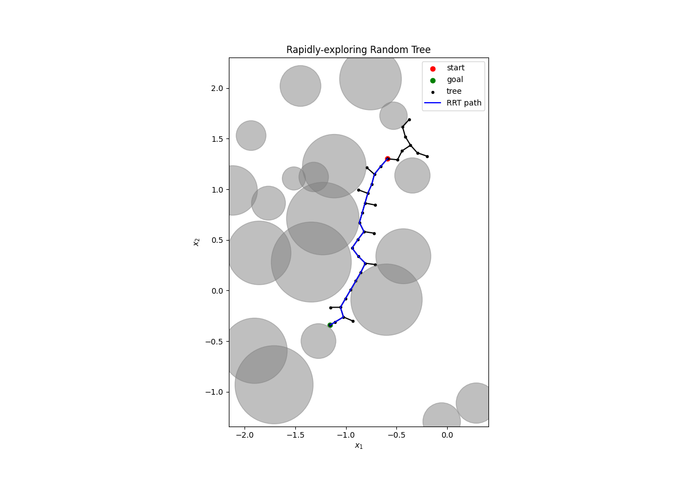

# Rapidly-exploring Random Tree



## Introduction

In this repository, I propose a python implementation of the Rapidly-exploring Random Tree. It is a very powerful (brute-forcing) algorithm for navigating in cluttered environments.

The development of this code was influenced by the following articles:
* [the original paper by Steven M. Lavalle](https://msl.cs.illinois.edu/~lavalle/papers/Lav98c.pdf): *Rapidly-Exploring Random Trees: A New Tool for Path Planning.*
* the second paper by J.J. Kuffner and S.M. LaValle. *RRT-connect: An efficient approach to single-query path planning*
* [the rrt article on wikipedia](https://en.wikipedia.org/wiki/Rapidly-exploring_random_tree)


## Requirements

This implementation only requires 2 libraries: numpy and matplotlib!

## How to use it

```python
import numpy as np
from rrt import SingleRRT

if __name__=='__main__':
    # 1. Choose dimension of the problem, start and target configurations.
    N = 2
    start = np.random.rand(N)
    goal = np.random.rand(N)

    # 2. Instantiate the RRT object.
    r = SingleRRT(N, start, goal)
    r.run()

    # 3. Plot the results if in dimension 2
    if N==2:
        r.plot()
```

The code can easily be extended to more complex obstacles. For this, the user will need to override the obstacle generation method as well as the collision detection.

## Use cases

Many use cases exist for this planner: car parking, maze escaping.

This planner can also be used with robotic manipulators. I successfully used it on a KUKA iiwa7 robot. For this, the RRT was conducted in the joint space of the robot while the collision detection was done in the task space. I used a pybullet simulator embedding the robot and the obstacles conduct the collision detection.


## Remarks

I recommend to take a look at the papers cited above to get an intuition of the algorithm.

As the output of RRT is very chaotic due to the random sampling in the search space, one needs to post-process it. In this implementation, I don't propose such post-processing function. Users can have a look at the Shortcutting algorithm (see [osrobotics](https://www.osrobotics.org/osr/planning/post_processing.html)).

All of this works well for high dimensional problems. However, the plotting function won't work anymore.


## License

Distributed under the MIT License. See the [license](LICENSE) for more information.